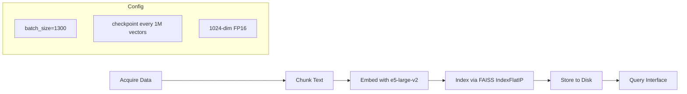
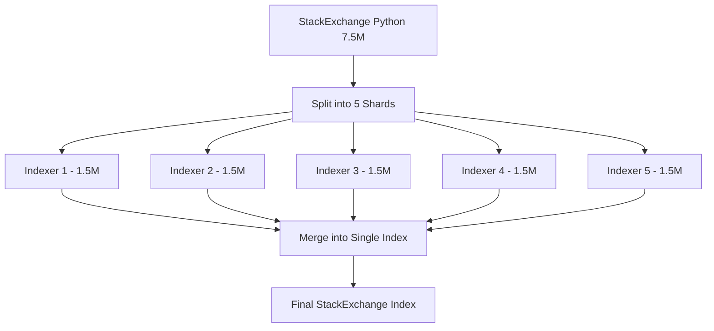

# Architecture: Semantic Indexing Batch 02

This document describes the architecture for indexing 8.35M vectors across three datasets using e5-large-v2 embeddings and FAISS.

## Data Processing Pipeline

## Query Pipeline

## Split-Merge Pattern for StackExchange

StackExchange Python contains 7.5M vectors and is processed using a split-merge pattern with 5 parallel indexers.

## Component Responsibilities

| Component | Responsibility |
|---|---|
| `acquire` | Download and validate raw datasets (Wikipedia FA, StackExchange Python, ArXiv ML) |
| `chunk` | Split documents into embedding-ready text segments |
| `embed` | Encode chunks using e5-large-v2 (1024-dim, FP16) with `passage:` prefix |
| `index` | Build FAISS IndexFlatIP with checkpointing every 1M vectors |
| `store` | Persist index files and metadata mappings to disk |
| `query` | Accept user queries with `query:` prefix, return ranked results via inner product search |
| `split-merge` | Parallelize StackExchange indexing across 5 workers, then merge into a single index |
| `checkpoint` | Save intermediate state every 1M vectors for fault tolerance |

## Scale Reference

| Dataset | Vectors | Notes |
|---|---|---|
| Wikipedia Featured Articles | 352K | High-quality encyclopedic content |
| StackExchange Python | 7.5M | Split-merge across 5 parallel indexers |
| ArXiv ML Abstracts | 489K | Machine learning paper abstracts |
| **Total** | **8.35M** | 1024-dim FP16, FAISS IndexFlatIP |

## Embedding Configuration

- **Model**: e5-large-v2
- **Dimensions**: 1024
- **Precision**: FP16
- **Batch size**: 1,300
- **Index type**: FAISS IndexFlatIP (inner product / cosine similarity on normalized vectors)
- **Checkpointing**: Every 1,000,000 vectors
